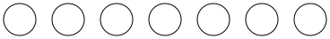
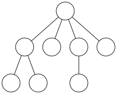

## 如何学习数据结构

  - 重要地位
  - 学习方法
  - 学习要求

. . .

  - 教学资源
    - https://zhuangbo.github.io/ds-cpp/
    - https://github.com/zhuangbo/ds-cpp

# 1.1 学科背景

## 用计算机解决问题的步骤

  1) 抽象出数学模型
  2) 设计算法
  3) 编写程序
  4) 测试、调试得到结果

## 数学模型的例子

  - 数值计算问题
    - 线性方程组
    - 微分方程
  - 非数值计算问题
    - 例1-1：书目检索
    - 例1-2：人机对弈
    - 例1-3：交通灯管理

## 数据结构学科

  - 研究对象
    - 非数值计算问题中计算机的操作对象以及它们之间的关系和操作
  - 历史沿革
  - 涉及范围
  - 重要地位

# 1.2 基本概念

##

数据
  ~ 对客观事物的符号表示
  ~ 含义广泛（整数，实数，图像，声音等）

数据元素
  ~ 数据的基本单位
  ~ 作为整体进行处理
  ~ 可由若干数据项组成

数据项
  ~ 数据的不可分割的最小单位

数据对象
  ~ 性质相同的数据元素的集合
  ~ 数据的子集

##

数据结构
  ~ 相互之间存在一种或多种特定关系的数据元素的集合

四类基本结构
  ~ 1) **集合**：同属一个集合
  ~ 2) **线性结构**：先后顺序
  ~ 3) **树形结构**：一对多
  ~ 4) **图（网）状结构**：多对多

- - -



. . .


- - -




- - -


##

数据结构
  ~ 形式定义：(D,S)
  ~ D：数据元素的有限集
  ~ S：D 上关系的有限集（逻辑结构）
  ~ 
  ~ 例1-4：复数
  ~ 例1-5：课题组

##

存储结构（物理结构）
  ~ 数据结构在计算机中的表示（映像）
  ~ **位**（bit） 0/1
  ~ **元素**（**结点**）--数据元素
  ~ **数据域**--数据项

##

关系的两种表示方法
  ~ **顺序映像**和**非顺序映像**

顺序映像
  ~ **顺序存储结构**
  ~ 借助元素在存储器中的相对**位置**来表示数据元素之间的逻辑关系

非顺序映像
  ~ **链式存储结构**
  ~ 借助**指针**表示数据元素之间的逻辑关系

##

数据类型
  ~ 一个**值的集合**（如整数）和一组**操作**（如加减乘除）
  ~ 分类：**原子类型**和**结构类型**
  ~ 作用：提供接口，隐藏细节

##

抽象数据类型（ADT）
  ~ 一个**数学模型**以及定义在该模型上的一组**操作**
  ~ 特点：1）仅取决于逻辑特性 2）与计算机内部表示无关
  ~ 作用：软件复用
  ~ 分类：**原子类型**(不可分解)、**固定聚合类型**(成分数目确定)和**可变聚合类型**(成分数目不定)

##

ADT 的形式定义
  ~ (D,S,P)
  ~ D：数据对象
  ~ S：D 上的关系集
  ~ P：对 D 的基本操作集
  ~ 例1-6：三元组 ADT

##

多形数据类型
  ~ 值的成分不确定
  ~ 需要面向对象、泛型（模板）等方法描述

# 1.3 ADT的表示与实现

## 

  - 描述语言：C/C++
  - 扩充
    - C
        - 常量 TRUE/FALSE, OK/ERROR...
        - 结果状态 Status
    - C++
        - 输入输出 <iostream>, cin, cout
        - 引用 E&, const E&
        - 模板 template<typename E>
        - 内存分配 new, delete
        - 异常处理 throw, try-catch
  - 例1-7：三元组

# 1.4 算法

## 算法

算法
  ~ 对特定问题求解步骤的一种描述
  ~ 它是指令的有限序列
  ~ 其中每一条指令表示一个或多个操作。

## 算法的特性
  - 有穷性
    * 有限步
    * 有限时间 
  - 确定性：无二义性
  - 可行性
  - 输入：零个或多个输入
    * 参数，文件，键盘输入等
  - 输出：一个或多个输出
    * 返回值，被更新的参数，屏幕输出等

## 算法的设计要求

  - 正确性
      - （a）无语法错误
      - （b）对几组输入数据
      - （c）对精心选择的几组数据
      - （d）对一切合法的输入数据
  - 可读性：便于阅读和理解
      - 格式规范（缩进，注释等）
  - 健壮性：错误处理
  - 效率与低存储量
      - 如何评价？

## 算法效率的度量

  - 事后统计
    - 利用计算机计时
    - 受到实际软硬件环境的影响
  - 事前分析
    - 时间复杂度：计算量与问题规模的关系

## 时间复杂度

时间复杂度
  ~ 基本操作的执行次数
  ~ 是问题规模 $n$ 的某个函数 $f(n)$
  ~ 算法的时间度量记作 $T(n)=O(f(n))$
  ~ 表示增长率相同

- - -

语句频度
  ~ 语句重复执行的次数，如 $f(n)=3n^2+5n+7$

大 $O$ 记号
  ~ 表示增长率相同，如：$O(3n^2+5n+7)=O(n^2)$
  ~ 写成化简形式：
  ~ （1）忽略正的常系数，如 $O(3n)=O(n)$
  ~ （2）忽略多项式中的低次项，如 $O(3n^2+5n)=O(n^2)$

- - -

语句频度和时间复杂度的分析方法
  ~ 顺序：时间求和
  ~ 选择：判断 + 运行时间最长者
  ~ 循环：循环体时间 × 迭代次数
  ~ 嵌套循环：从里向外逐层分析
  ~ 函数调用：从调用到返回的时间
  ~ 与输入数据有关：（1）最好情况 （2）最坏情况 （3）平均情况

- - -

几种常见的时间复杂度
  ~ 常数： $O(1)$
  ~ 对数： $O(\log n)$
  ~ 线性： $O(n)$
  ~ 多项式 $O({\rm polynomial}(n))$： $O(1)$, $O(n)$, $O(n^2)$, $O(n^3)$...
  ~ 指数：$O(2^n)$, $O(3^n)$...

## 时间复杂度分析举例

- 顺序搜索
- 二分搜索
- 最小值，最大值
- 整数幂
- 斐波那契数
- 冒泡排序

##

顺序搜索
  ~ 在数组 `a[n]` 中查找 `x`
  ~ 若找到，返回下标，若找不到，返回 `-1`

````c++
int find(E a[], int n, E x)
{
  for(i=0; i<n; i++) {
    if(a[i]==x) return i;
  }
  return -1; // not found
}
````

. . .

> - 比较次数：$n$
> - 时间复杂度：$O(n)$

##

**二分搜索**：在有序数组 `a[n]` 中查找元素 `x`

````c++
int binary_search(E a[], int n, const E& x)
{
    int low, mid, high;

    low = 0; high = n-1;
    while(low <= high) {
        mid = (low + high) / 2;
        if(a[mid] < x)
            low = mid + 1;
        else if(a[mid] > x)
            high = mid - 1;
        else
            return mid;
    }

    return -1; // not found
}
````

. . .

> - 比较次数：$\lfloor\log_2 n\rfloor+1$
> - 时间复杂度：$O(\log n)$

##

最小值，最大值
  ~ 求数组 `a[n]` 中的最小值（最大值）

````c++
E min(E a[], int n)
{
    E tmp = a[0];
    for(int i=1; i<n; i++)
        if(a[i] < tmp)
            tmp = a[i];
    return tmp;
}
````

. . .

> - 比较次数：$n-1$
> - 时间复杂度：$O(n)$

- - -

思考：若要求*同时*求出一个数组中的最小值和最大值，最少需要多少次比较呢？

. . .

$\lceil \frac{3n}{2} \rceil -1$


##

**整数幂**：求 $x^n$，其中 $n$ 为非负整数

````c++
double power(double x, int n) {
    if(n<0) throw std::invalid_argument("n<0");
    
    if(n==0) return 1;
    else if(n&1)  // odd or not
        return power(x*x, n/2)*x;
    else
        return power(x*x, n/2);
}
````

. . .

> 乘法次数：$\log_2 n$
> 时间复杂度：$O(\log n)$

##

斐波那契数

$$f(n) = \begin{cases} 0 & n=0 \\ 1 & n=1 \\ f(n-1)+f(n-2) & n>1 \end{cases}$$

````c++
long long fib1(int n)
{
    if(n<=1)
        return n;
    else
        return fib1(n-1) + fib1(n-2);
}
````
. . .

> 时间复杂度：$O(2^n)$
> 如何修改程序，使得时间复杂度降低为 $O(n)$？


##

冒泡排序

````c++
void bubble_sort(E a[], int n)
{
    for(int i=0; i<n-1; i++) {
        bool change = false;
        for(int j=0; j<n-i-1; j++) {
            if(a[j] > a[j+1]) {
                E temp = a[j];
                a[j] = a[j+1];
                a[j+1] = temp;

                change = true;
            }
        }
        if(!change) break;
    }
}
````

> 时间复杂度：$O(n^2)$
> 与输入数据有关：最好情况 $O(n)$

## 空间复杂度


空间复杂度
  ~ 算法所需存储空间的度量
  ~ 大 $O$ 记号


## 总结

- 掌握数据结构的基本概念和术语；
- 了解抽象数据类型的表示与实现；
- 掌握算法的概念；
- 理解算法的五个重要特征的确切含义；
- 了解算法设计的要求；
- 熟练掌握算法时间复杂度的分析方法。


---
###### SETTINGS ######
#revealjs-url: https://cdn.bootcss.com/reveal.js/3.4.1
math: |
  <script type="text/x-mathjax-config">
  MathJax.Hub.Config({showMathMenu:false,
  TeX:{equationNumbers:{autoNumber:'AMS'}}});
  </script>
  <script type="text/javascript" async 
  src="MathJax/MathJax.js?config=TeX-AMS_HTML">
  </script>
---
