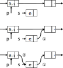

## 目标要求

- 掌握线性表的类型定义；
- 熟练掌握顺序表的表示、基本操作和算法实现；
- 熟练掌握链表的表示、基本操作和算法实现。

# 2.1 线性表的类型定义


## 线性结构

线性结构的特点
  ~ “第一个”
  ~ “最后一个”
  ~ **前驱**
  ~ **后继**


- - -

线性表
  ~ $n$ 个数据元素的有限序列


线性表的长度
  ~ 线性表中元素的个数 $n$ ($n \ge 0$)


空表
  ~ 长度为零的线性表

位序
  ~ 元素 $a_i$ 在表 $(a_1, a_2, \ldots, a_n)$ 中的位置 $i$

## 线性表 ADT

  - 数据对象：相同类型的 $n$ 个数据元素的集合
  - 数据关系：前驱、后继关系的集合
  - 基本操作：......

- - -

基本操作

> - **InitList(&L)** 构造空的线性表
  - **DestroyList(&L)** 销毁线性表
  - **ClearList(&L)** 清空线性表
  - **ListEmpty(L)** 判断线性表是否为空
  - **ListLength(L)** 返回线性表的长度
  - **GetElem(L,i,&e)** 取元素
  - **LocateElem(L,e,compare)** 元素定位
  - **ListInsert(&L,i,e)** 插入元素
  - **ListDelete(&L,i,&e)** 删除元素
  - **ListTraverse(L,visit)** 遍历线性表

## 线性表的应用

  - 例2-1：求集合的并集 $A\Leftarrow A \cup B$

````c++
/// 将所有在线性表 Lb 中但不在 La 中的数据元素插入到 La 中
void union(List& La, List Lb)
{
  for(i=1; i<=ListLength(Lb); i++) {
    GetElem(Lb,i,e);
    if(!LocateElem(La,e,equal))
      ListInsert(La,ListLength(La)+1,e);
  }
}
````

. . .

时间复杂度： $O(n_a \times n_b)$

- - -

  - 例2-2：归并有序表

> 问题描述：线性表 la 和 lb 中的数据元素按值非递减有序排列，要求将 la 和 lb **归并**成一个新的线性表 lc，且 lc 中的数据元素仍按值非递减有序排列。

. . .

  - 算法思路：
    1) 创建新表 lc
    2) 同时遍历线性表 La 和 lb，将较小的元素插入新表 lc 末尾
    3) 若表 la 或 lb 有剩余元素，则逐个插入表 lc 末尾

- - -

````c++
/// 将非递减有序的线性表 la 和 lb 归并到新的线性表 lc 中，保持非递减有序
void MergeList(List la, List lb, List& lc)
{
  // 创建线性表 lc
  InitList(lc);
  // 同时遍历线性表 La 和 lb，将较小的元素插入新表 lc 末尾
  i = j = k = 1;
  na = ListLength(la); nb = ListLength(lb);
  while( i<=na && j<=nb ) {
    GetElem(la,i,ai); GetElem(lb,j,bj);
    if(ai<=bj) { ListInsert(lc,k,ai); ++k; ++i; }
    else { ListInsert(lc,k,bj); ++k; ++j; }
  }
  // 剩余元素逐个插入表 lc 末尾
  while( i<=na ) {
    GetElem(la,i,ai); ListInsert(lc,k,ai); ++k; ++i;
  }
  while( j<=nb ) {
    GetElem(lb,j,bj); ListInsert(lc,k,bj); ++k; ++j;
  }
}
````

. . .

时间复杂度： $O(n_a+n_b)$


# 2.2 线性表的顺序表示和实现

## 顺序表

顺序表
  ~ 线性表的顺序存储结构
  ~ 存储特点：a）逻辑上相邻的元素在物理位置上也是相邻的，b）随机存取。

## 顺序表的类型定义

````c++
// 顺序表类型定义
struct SqList {
    T elem[MAXSIZE];  // 存储数据元素的空间
    int length;  // 当前长度
};
````

. . .

````c++
// 顺序表类型定义（用 C++ 模板实现）
template<typename T, int MAXSIZE>
struct SqList {
    T elem[MAXSIZE];  // 存储数据元素的空间
    int length;  // 当前长度
};
````

## 顺序表的基本形态

  - **表空**： L.length==0，无法删除
  - **表满**： L.length==MAXSIZE，无法插入
  - 非空（非满）：可以插入和删除


## 顺序表基本操作的实现

  - **InitList(&L) 初始化顺序表**

````c++
void InitList(SqList& L) {
    L.length = 0;  // 空表长度为 0
}
````

  - **ClearList(&L) 清空顺序表**

````c++
void ClearList(SqList& L)
{
    L.length = 0;
}
````

- - -

  - **ListLength(L) 求长度**

````c++
int ListLength(const SqList& L)
{
    return L.length;
}
````

  - **ListEmpty(L) 判空**

````c++
bool ListEmpty(const SqList& L)
{
    return L.length == 0;
}
````

- - -

- **GetElem(L,i,&e) 取元素**
  * 随机访问 O(1)


````c++
bool GetElem(const SqLis& L, int i, T& e)
{
    // 若 i 值不合法，则返回 false
    if(i<1 || i>L.length)  return false;

    // 取第 i 个元素
    e = L.elem[i-1];

    // 返回 true 表示操作成功
    return true;
}

// 另一种实现
T GetElem(const SqList& L, int i)
{
    // 若 i 值不合法，不能取元素
    if(i<1 || i>L.length)
        throw out_of_range("i out of range");

    // 返回第 i 个元素
    return L.elem[i-1];
}
````

- - -

  - **LocateElem(L,e) 元素定位**
    - 在顺序表 L 中查找数据元素 e
    - 若找到，返回位序，否则返回 0

````c++
int LocateElem(const SqList& L, T e)
{
    // 逐个取出元素与 e 比较
    for(i = 0; i < L.length; i++) {
        // 若满足条件，则返回位序
        if(L.elem[i] == e)  return i+1;
    }

    return 0; // 不存在
}
````

- - -

  - **LocateElem(L,e,cond) 元素定位**
    - 返回顺序表 L 中第一个与 e 满足关系 cond 的数据元素的位序
    - 若找到，返回位序，否则返回 0

````c++
int LocateElem(const SqList& L, T e, C cond)
{
    // 逐个取出元素与 e 比较
    for(i = 0; i < L.length; i++) {
        // 若满足条件，则返回位序
        if(cond(L.elem[i],e))  return i+1;
    }

    return 0; // 不存在
}
````

- - -

  - **LocateElem(L,e,cond) 元素定位**
    - 其中比较条件 cond 可以使用自定义函数，非常灵活

````c++
// 自定义比较条件
bool eq(T a, T b) { return a == b; }
bool lt(T a, T b) { return a < b; }
bool gt(T a, T b) { return a > b; }
bool le(T a, T b) { return a <= b; }
bool ge(T a, T b) { return a >= b; }

// 用不同条件进行元素定位
LocateElem(L,e,eq)  // 定位第一个等于 e 的元素
LocateElem(L,e,lt)  // 定位第一个小于 e 的元素
LocateElem(L,e,gt)  // 定位第一个大于 e 的元素
LocateElem(L,e,le)  // 定位第一个小于等于 e 的元素
LocateElem(L,e,ge)  // 定位第一个大于等于 e 的元素
````

- - -

  - **ListTraverse(L,visit) 遍历顺序表**
    - 遍历顺序表，依次对 L 中的每个数据元素调用函数 visit
    - 定义不同的 visit 函数即可实现不同的功能

````c++
void ListTraverse(const SqList& L, Func visit)
{
    for(int i = 0; i < L.length; i++) {
        visit(L.elem[i]);
    }
}
````

## 插入元素 ListInsert(&L,i,e)

  - **问题描述**：在顺序表 L 中第 i 个位置插入元素 e
  - **算法思路**：
    - *异常情况*
        - 表满：L.length==MAXSIZE
        - 参数 i 不合理：i<1 || i>L.length+1
    - *一般步骤*
        - （1）移动元素（哪些元素？如何移动？）
        - （2）插入元素
        - （3）表长增 1

- - -


  - *一般步骤*
    - （1）移动元素（哪些元素？如何移动？）
    - （2）插入元素
    - （3）表长增 1

- - -

- **算法实现**：

````c++
/// 在顺序表 L 中第 i 个位置之前插入新的数据元素 e
void ListInsert(SqList& L, int i, T e)
{
    // 若表满，则不能插入
    if(L.length==MAXSIZE) throw length_error("L is full");
    // 若 i 值不合法，则不能插入
    if(i<1 || i>L.length+1) throw out_of_range("i out of range");

    // 插入位置及之后的元素后移
    for(int j=L.length-1; j>=i-1; j--) {
        L.elem[j+1] = L.elem[j];
    }
    // 插入元素
    L.elem[i-1] = e;
    // 表长增 1
    L.length++;
}
````

- - -

  - **插入算法的时间复杂度分析**
    - *基本操作*：移动元素
    - *移动次数*与插入位置 $i$ 及表长 $n$ 有关
        - 最好情况：表尾插入（移动 $0$ 次）
        - 最坏情况：表头插入（移动 $n$ 次）
        - 平均（等概率）情况：$$\frac{1}{n+1} \sum_{i=1}^{n+1} (n-i+1) = \frac{n}{2}$$ 即平均移动 $\frac{n}{2}$ 个元素
    - *时间复杂度（平均情况）*：$O(n)$

## 删除元素 ListDelete(&L,i,&e)

  - **问题描述**：在顺序表 L 中删除第 i 个元素，用 e 返回
  - **算法思路**：
    - *异常情况*：
        - 表空：L.length==0
        - 参数 i 不合理：i<1 || i>L.length
    - *一般步骤*：
        - （1）取出数据
        - （2）移动元素（哪些元素？如何移动？）
        - （3）表长减 1

- - -


  - *一般步骤*：
      - （1）取出数据
      - （2）移动元素（哪些元素？如何移动？）
      - （3）表长减 1

- - -

  - **算法实现**：

````c++
/// 在顺序表 L 中删除第 i 个元素，用 e 返回
void ListDelete(SqList& L, int i, T& e)
{
    // 若表空，则不能删除，抛出异常
    if(L.length==0) throw length_error("L is empty");
    // 若 i 值不合法，则不能删除
    if(i<1 || i>L.length) throw out_of_range("i out of range");
    
    // 取出被删除元素
    e = L.elem[i-1];
    // 被删除元素之后的元素前移
    for(int j=i; j<L.length; j++) {
        L.elem[j-1] = L.elem[j];
    }
    // 表长减 1
    L.length--;
}
````

- - -

  - **删除算法的时间复杂度分析**
    - *基本操作*：移动元素
    - *移动次数*与删除位置 $i$ 及表长 $n$ 有关
        - 最好情况：表尾删除（移动 $0$ 次）
        - 最坏情况：表头删除（移动 $n-1$ 次）
        - 平均（等概率）情况：$$\frac{1}{n} \sum_{i=1}^{n} (n-i) = \frac{n-1}{2}$$ 即平均移动 $\frac{n-1}{2}$ 个元素
    - *时间复杂度（平均情况）*：$O(n)$

## 动态分配空间的顺序表

  - **类型定义**

````c++
/// 顺序表类型定义
struct SqList {
  T *elem;      // 动态分配的存储空间
  int listsize; // 当前分配的存储容量
  int length;   // 当前长度
};
````

  - **动态分配空间**
    - 表满后可扩大空间（倍增）
    - 初始化、销毁、插入等操作时管理存储空间

- - -


  - **动态分配空间**
    - 表满后可扩大空间（倍增）
    - 初始化、销毁、插入等操作时管理存储空间

- - -

  - **InitList(&L) 初始化顺序表**
    - 动态分配内存（初始容量）
    - 置空表 L.length = 0

````c++
void InitList(SqList& L)
{
  L.elem = new T [INIT_SIZE];  // 按初始容量分配空间
  L.listsize = INIT_SIZE;
  L.length = 0;  // 置空表
}
````

- - -

  - **DestroyList(&L) 销毁顺序表**

````c++
void DestroyList(SqList& L)
{
  delete[] L.elem;  // 释放存储空间
  L.listsize = 0;
  L.length = 0;
}
````

> - 用 `new` 分配空间，则用 `delete` 释放空间。
  - 用 `new []` 分配空间，对应地用 `delete[]` 释放空间。

## 分配空间失败如何处理？

  - C 语言：检查是否返回空指针 `NULL`，需处理。
    - 一般是调用 exit() 退出程序
  - C++：抛出异常 `std::bad_alloc`，一般不处理。
    - 必要时可以在函数外部捕获异常进行处理
  - 实际上
    - 动态分配内存失败极少出现
    - 系统已接近崩溃，程序已无计可施
    - 与其痛苦地挣扎，不如痛快地结束（崩溃）
  - 总结：用 C++ 的 new 而不是 C 语言的 malloc()。

- - -

  - **扩展存储空间**
    - （1）分配新空间
    - （2）复制旧元素
    - （3）释放旧空间
    - （4）指向新空间

````c++
/// 为顺序表 L 重新分配空间更多空间（加倍）
void expand(SqList& L)
{
  // 分配新空间
  n = L.listsize * 2;
  p = new T [n];
  // 复制元素
  for(i=0; i<L.length; i++) p[i] = L.elem[i];
  // 释放旧空间
  delete[] L.elem;
  // 指向新空间
  L.elem = p;
  L.listsize = n;
}
````

## 插入元素 ListInsert(&L,i,e)

  - 在动态分配空间的顺序表中插入元素
    - 表满（L.length==L.listsize）时先扩展存储空间再插入

````c++
/// 在顺序表 L 中第 i 个位置之前插入新的数据元素 e
void ListInsert(SqList& L, int i, T e)
{
    // 若 i 值不合法，则不能插入
    if(i<1 || i>L.length+1) throw out_of_range("i out of range");
    // 若表满，则扩展空间
    if(L.length==L.listsize) expand(L);

    // 插入位置及之后的元素后移
    for(int j=L.length-1; j>=i-1; j--) {
        L.elem[j+1] = L.elem[j];
    }
    // 插入元素
    L.elem[i-1] = e;
    // 表长增 1
    L.length++;
}
````

## 顺序表应用举例

  * 求集合的并集
    * 插入在表尾
    * $O(m\times n)$
  * 归并有序表
    * $O(m+n)$

# 2.3 线性表的链式存储结构

## 线性链表

线性链表
  ~ 用一组任意的存储单元存储线性表的数据元素
  ~ 存储空间不一定是连续的
  ~ 特点：（1）只能顺序访问，不能随机存取 （2）插入、删除时无需移动元素

结点
  ~ **数据域**存储数据元素
  ~ **指针域**存储直接后继的存储位置

- - -

链表
  ~ $n$ 个结点链结成**链表**

单链表
  ~ **头指针**指向第一个结点
  ~ **头结点**是附设在第一个数据结点之前的结点
  ~ 最后一个结点的指针域为**空指针**


## 单链表类型定义

类型定义
  ~ **结点**结构 LNode
  ~ 指针代表的**链表**类型 LinkList

````c++
/// 单链表结点结构
struct LNode {
    T  data;  // 数据域
    LNode *next;  // 指针域
};

/// 链表类型
typedef LNode *LinkList;
````

## 单链表基本形态

不带头结点的单链表
  ~ 没有头结点
  ~ 头指针指向第一个数据结点

基本形态
  ~ 空表：`L == NULL`
  ~ 非空表


## 单链表基本形态

带头结点的单链表
  ~ 附设头结点
  ~ 头指针指向头结点
  ~ 某些情况下可简化编程，更常用

基本形态
  ~ 空表：`L->next == NULL`
  ~ 非空表


（以下假设采用带头结点的单链表）

## 遍历单链表的方法

  - **遍历单链表**
    - （1）逐个访问数据元素
    - （2）查找元素
    - （3）查找第 i 个元素
    - （4）查找第 i-1 个元素

- - -

  - （1）逐个访问数据元素

````c++
p = L->next;
while(p!=NULL) {
    visit(p->data);
    p = p->next;
}
````

````c++
for(p=L->next; p; p=p->next)
    visit(p->data);
````

- - -

  - （2）查找元素

````c++
/// 在单链表 L 中查找元素 x
/// 若找到，返回指向该结点的指针，否则返回空指针
LinkList Find(LinkList L, T x)
{
  p = L->next;
  while(p!=NULL) {
    if(p->data == x) return p; // 找到 x
    p = p->next;
  }

  return NULL; // 未找到
}
````

- - -

  - （3）查找第 i 个元素

````c++
/// 在单链表 L 中查找第 i 个元素
/// 若找到，返回指向结点的指针，否则返回空指针
LinkList Get(LinkList L, int i)
{
  p = L->next; j = 1;
  while(p!=NULL && j<i) {
    p = p->next; j++;  // 遍历链表，同时用 j 计数
  }

  if(p && j==i) return p;
  else return NULL;
}
````

- - -

  - （4）查找第 i-1 个元素

````c++
  p = L; j = 0;  // 从头结点开始计数
  while(p && j<i-1) {
    p = p->next; j++;
  }

  if(p && j==i-1) return p;
  else return NULL;
````

## 单链表的基本操作

  - **InitList(&L)** 初始化空表


````c++
/// 初始化（带头结点的）空链表
void InitList(LinkList &L)
{
    // 创建头结点
    L = new LNode;
    // 初始化为空表
    L->next = NULL;
}
````
- - -

  - **ListEmpty(L)** 链表判空

````c++
/// 判断链表 L 是否为空表
bool ListEmpty(LinkList L)
{
    return L->next==NULL;
}
````

- - - 

  - **ClearList(&L)** 清空链表

````c++
/// 清空链表
void ClearList(LinkList& L)
{
    // 当表不空时，逐个删除结点
    while(L->next) {
        p = L->next;  // p 指向第一个数据结点
        L->next = p->next;  // 从链表中解除结点
        delete p;  // 释放结点存储空间
    }
}
````

  - **DestroyList(&L)** 销毁链表

````c++
/// 销毁链表
void DestroyList(LinkList& L)
{
    ClearList(L);  // 清空链表
    delete L;  // 释放头结点
    L = NULL;  // 指针置空（防野指针）
}
````

- - -

  - **ListLength(L)** 链表求长度

````c++
/// 求表长
int ListLength(LinkList L)
{
    n = 0;
    p = L;
    while(p->next) {
        ++n;
        p = p->next;
    }
    return n;
}
````

- - -

  - **GetElem(L,i,&e)** 取元素

````c++
/// 取元素
void GetElem(LinkList L, int i, T& e)
{
    // 找到第 i 个结点 p
    p = L->next;  j = 1;
    while(p && j<i) {
        p = p->next; ++j;
    }
    
    // 若存在，则取数据，否则抛出异常
    if(p && j==i) {  // 找到第 i 个结点
        e = p->data;  // 取出结点数据
    } else {  // 不存在第 i 个结点
        throw out_of_range("i out of range");
    }
}
````

## 单链表插入 ListInsert(&L,i,e)

  - **问题**：在单链表 L 中第 i 个位置插入元素 e
  - **算法思路**：
    - *异常情况*：参数 i 不合理（第 i-1 个结点不存在）
    - *一般步骤*：
        - （1）找到第 i-1 个结点（为何不是 i？）
        - （2）在其后插入元素

- - -



- - -

  - 单链表插入算法

````c++
/// 在单链表 L 中第 i 个位置插入数据元素 e
void ListInsert(LinkList& L, int i, T e)
{
    // 找到第 i-1 个结点 p
    p = L;  j = 0;
    while(p && j<i-1) {
        p = p->next; ++j;
    }
    
    // 若找到，则在 p 后插入 e，否则抛出异常
    if(p && j==i-1) {
        // 新建结点
        s = new LNode;
        s->data = e;
        // 在链表中插入结点
        s->next = p->next;  //①
        p->next = s;        //②
    } else {
        throw out_of_range("i out of range");
    }
}
````

. . .

时间复杂度：$O(n)$ （插入前查找第 i-1 个结点）

- - -

  - **算法分析**
    - 基本操作：遍历链表，查找第 i-1 个结点
    - 与插入位置有关
        - 最好情况：插入在开头 $O(1)$
        - 最坏情况：插入在末尾 $O(n)$
        - 平均情况：时间复杂度 $O(n)$
    - 特点：整个插入过程，不需要移动结点

## 单链表删除 ListDelete(&L,i,&e)

  - **问题**：删除单链表 L 中第 i 个数据元素并用 e 返回
  - **算法思路**
    - *异常情况*：参数 i 不合理（第 i 个结点不存在）
    - *一般步骤*：
        - （1）找到第 i-1 个结点（为何不是 i？）
        - （2）删除下一个（第 i 个）结点
    - 特点：整个插入过程，不需要移动结点

- - -


- - -

  - 单链表删除算法

````c++
/// 删除单链表 L 中第 i 个数据元素并用 e 返回
void ListDelete(LinkList& L, int i, T& e)
{
    // 寻找找第 i-1 个结点 p
    p = L;  j = 0;
    while(p && j<i-1) {
        p = p->next; ++j;
    }
    
    // 若找到且存在第 i 个结点，则删除 p 的下一个结点，否则抛出异常
    if(p && p->next && j==i-1) {
        // 删除第 i 个结点 q
        q = p->next;   //① q 指向第 i 个结点
        p->next = q->next;  //② 从链表中移除结点 q
        // 取出数据，释放结点
        e = q->data;        // 取被删除结点的数据
        delete q;           // 释放结点的存储空间
    } else {
        throw out_of_range("i out of range");
    }
}
````

. . .

时间复杂度：$O(n)$ （删除前查找第 i-1 个结点）

- - -

  - **算法分析**
    - 基本操作：遍历链表，查找第 i-1 个结点
    - 与删除位置有关
        - 最好情况：删除第一个 $O(1)$
        - 最坏情况：删除最后一个 $O(n)$
        - 平均情况：时间复杂度 $O(n)$
    - 特点：整个删除过程，不需要移动结点


## 输入数据创建链表

  - **CreateList(&L,n)** 输入 n 个数据创建链表
  - **算法思路**：
    - （1）建立空表
    - （2）逐个插入结点
        - 插入表头（逆序建表）
        - 插入表尾（顺序建表）

- - -

  - 建立链表算法（逆序）
    - 在表头插入结点

````c++
// 输入 n 个数据，建立链表
void CreateList(LinkList &L, int n)
{
  // 建立空表
  L = new LNode;
  L->next = NULL;
  // 输入数据，逐个插入表头
  for(i=0; i<n; i++) {
    // 输入数据
    cin >> e;
    // 建立结点
    s = new LNode;
    s->data = e;
    // 插入表头
    s->next = L->next;
    L->next = s;
  }
}
````

- - -

  - 建立链表算法（顺序）
    - 在表尾插入结点

````c++
// 输入 n 个数据，建立链表
void CreateList(LinkList &L, int n)
{
  // 建立空表
  L = new LNode;
  L->next = NULL;
  // 输入数据，逐个插入表尾
  p = L;  // 用 p 指示表尾
  for(i=0; i<n; i++) {
    // 输入数据
    cin >> e;
    // 建立结点
    s = new LNode;
    s->data = e;
    // 插入表尾
    s->next = p->next;
    p->next = s;
    // p 指向新的表尾
    p = s;  // 或 p = p->next; 亦可
  }
}
````

## 链表归并算法

  - **有序链表的归并**：将两个非递减有序的链表 la 和 lb 合并成一个新的链表 lc，令 la 和 lb 成为空表，新表 lc 仍保持非递减有序。
  - **算法思路**：
    - （1）建立新表 lc
    - （2）同时遍历表 la 和 lc，归并到新表 lc
    - （3）将剩余部分表插入表 lc 末尾
    - （4）将表 la 和 lb 置空

- - -

````c++
/// 将两个非递减有序的链表 la 和 lb 合并成一个新的链表 lc
void MergeList(LinkList& la, LinkList& lb, LinkList& lc) {
  // 建立新表 lc
  lc = new LNode;
  lc->next = NULL;
  // 同时遍历表 la 和 lc，归并到新表 lc
  pa = la->next;
  pb = lb->next;
  pc = lc;
  while(pa && pb) {
    if(pa->data < pb->data) {
      pc->next = pa;
      pa = pa->next;
      pc = pc->next;  // or pc = pa;
    } else {
      pc->next = pb;
      pb = pb->next;
      pc = pc->next;  // or pc = pb;
    }
  }
  // 将剩余部分表插入表 lc 末尾
  pc->next = pa ? pa : pb;  // pa 和 pb 仅有一个非空
  // 将表 la 和 lb 置空
  la->next = NULL;
  lb->next = NULL;
}
````

- - -

  - 链表归并算法的分析
    - 仅修改结点之间的逻辑关系，不移动结点。
    - 链表的剩余部分可以在 $O(1)$ 时间内完成插入。
    - 时间复杂度：$O(\min(m,n))$

## 静态链表

静态链表
  ~ 用数组模拟链表和动态内存管理
  ~ 未使用的结点也要连成链表，供“分配”和“释放”空间使用。

## 循环链表

  - **循环链表**：令最后一个结点的指针域指向头结点，形成循环链表
    - 从任何一个结点出发，都可以遍历链表中的所有结点
    - 基本形态：（1）空表 L->next==L，（2）非空表
    - 与单链表的区别：判断表尾的条件不同


- - -

仅设尾指针的单循环链表
  ~ 方便在表尾和表头插入元素
  ~ 可以在 $O(1)$ 时间内合并两个表

## 双向链表

双向链表
  ~ 结点中包含两个指针域，分别指向直接前驱和后继
  ~ 双向链表的类型定义

````c++
/// 双向链表结点结构
struct Node {
    T data;      // 数据域
    Node *next;  // 指向后继的指针
    Node *prev;  // 指向前驱的指针
};

/// 双向链表类型
typedef Node *List;
````

- - -

  - 双向链表的基本形态
    - （1）空表：L->next == NULL
    - （2）非空表

  - **双向循环链表**
    - 前后两个方向上形成成循环链表
    - （1）空表：L->next == L
    - （2）非空表


- - -

  - **双向循环链表插入算法** ListInsert(&L,i,e)
    - 修改两个方向的指针

````c++
/// 在双向循环链表 L 中第 i 个位置插入元素 e
void ListInsert(List& L, int i, T e)
{
    // 找到第 i 个结点 p
    int j = 1;
    p = L->next;
    while(p!=L && j<i) {  // 注意表尾的判别
        p = p->next;
        ++j;
    }
    // 若找到，则在 p 之前插入 e，否则抛出异常
    if(j==i) { // 若 p==L 则在表尾插入
        // 新建结点
        s = new Node;
        s->data = e;
        // 在链表中插入结点
        s->prev = p->prev;
        s->prev->next = s;
        s->next = p;
        p->prev = s;
    } else {
        throw out_of_range("i out of range");
    }
}
````

- - -

  - **双向循环链表删除算法** ListDelete(&L,i,&e)
    - 修改两个方向的指针

````c++
/// 删除双向循环链表 L 中第 i 个数据元素，用 e 返回
void ListDelete(List& L, int i, T& e)
{
    // 寻找找第 i 个结点 p
    int j = 1;
    auto p = L->next;
    while(p!=L && j<i) {
        p = p->next;
        ++j;
    }
    // 若找到第 i 个结点，则删除之，否则抛出异常
    if(p!=L && j==i) {  // 第 i 个结点必须存在
        // 从链表上移除结点
        p->prev->next = p->next;
        p->next->prev = p->prev;
        // 取出数据
        e = p->data;
        // 释放结点
        delete p;
    } else {
        throw out_of_range("i out of range");
    }
}
````

## 顺序表和单链表的比较

         顺序表	                单链表
---------------------------  ---------------------------------
以地址相邻表示关系	             用指针表示关系
随机访问，取元素$O(1)$	        顺序访问，取元素$O(n)$
插入、删除需要移动元素$O(n)$	    插入、删除不用移动元素$O(n)$

## 各种线性结构对比


## 习题

---
###### SETTINGS ######
#revealjs-url: https://cdn.bootcss.com/reveal.js/3.4.1
math: |
  <script type="text/x-mathjax-config">
  MathJax.Hub.Config({showMathMenu:false,
  TeX:{equationNumbers:{autoNumber:'AMS'}}});
  </script>
  <script type="text/javascript" async 
  src="MathJax/MathJax.js?config=TeX-AMS_HTML">
  </script>
---
