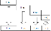
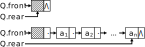
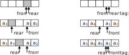

## 目标要求

- 理解栈和队列的定义；
- 熟练掌握栈的特点、栈的存储结构、基本操作和算法实现；
- 熟练掌握队列的特点、队列的存储结构、基本操作和算法实现；
- 会在相应的应用问题中正确选用栈和队列。

# 3.1 栈

## 栈及其特点

栈（Stack）
  ~ 栈是一种特殊的线性表
  ~ 仅在表尾进行插入和删除

栈顶和栈底
  ~ 表尾（插入删除的一端）称为**栈顶**
  ~ 表头称为**栈底**

- - -

入栈和出栈
  ~ 插入元素称为入栈（push）
  ~ 删除元素称为出栈（pop）

栈的操作有何特点？
  ~ 最先出栈的必定是最后进栈的栈顶元素
  ~ 栈的操作具有**后进先出(LIFO)**的特点

## 栈的 ADT 定义

  - 数据对象：相同类型
  - 数据关系：线性关系
  - 基本操作：
    - InitStack (&S) 初始化
    - DestroyStack (&S) 销毁
    - ClearStack (&S) 清空
    - StackEmpty (S) 判空
    - StackLength (S) 求长度

- - -

  - 基本操作：
    - GetTop (S,&e) / (S) 取栈顶
    - Push (&S,e) 入栈
    - Pop (&S,&e) / (&S) 出栈
    - StackTraverse (S,visit) 遍历

## 栈的顺序存储结构——顺序栈

  - （1）顺序栈的类型定义
    - `elem` 保存数据元素，最大容量 `MAXSIZE`
    - `top` 指示栈顶（这里约定为栈顶元素的下一个位置）

````c++
struct SqStack {
    T elem[MAXSIZE];
    int top;
};
````

- - -

  - （2）顺序栈的基本形态
    - 栈空：`S.top==0` 不能出栈，不能取栈顶元素
    - 栈满：`S.top==MAXSIZE` 不能入栈
    - 栈非空（非满）

- - -

  - （3）顺序栈基本操作的实现
    - InitStack(&S) 构造空栈
    - StackEmpty(S) 判空
    - StackLength(S) 求长度

````c++
/// 初始化空栈
void InitStack(SqStack& S)
{
    S.top = 0;
}

/// 判空
bool StackEmpty(const SqStack& S)
{
    return S.top == 0;
}

/// 求长度
int StackLength(const SqStack& S)
{
    return S.top;
}
````

## 入栈 Push(&S,e)

  - 算法思路：若栈满则出错，否则在栈顶插入元素

````c++
/// 入栈
void Push(SqStack<T,MAXSIZE>& S, T e)
{
    // 栈满则溢出
    if(S.top == MAXSIZE)
        throw overflow_error("Stack overflow");
    // 入栈（在栈顶插入元素）
    S.elem[S.top++] = e;
}
````
. . .

> 入栈也可以写成两句：
````c++
  S.elem[S.top] = e;
  S.top++;
````

## 出栈 Pop(&S,&e)

算法思路：若栈空则出错，否则删除栈顶元素

````c++
/// 出栈
void Pop(SqStack& S, T& e)
{
    // 栈空则下溢
    if(S.top==0)
        throw underflow_error("Stack underflow");
    // 出栈（删除栈顶元素）
    e = S.elem[--S.top];
}
````

. . .

> 出栈也可以写成两句：
````c++
  e = S.elem[S.top-1];
  S.top--;
````

## 取栈顶元素 Top(S,&e)

算法思路：若栈空则出错，否则返回栈顶元素

````c++
/// 取栈顶元素
void GetTop(const SqStack& S, T& e)
{
    // 栈空则下溢
    if(S.top==0)
        throw underflow_error("Stack underflow");
    // 返回栈顶元素
    e = S.elem[S.top - 1];  // 栈顶元素的下标 top-1
}
````

- - -

  - （4）顺序栈与顺序表
    - 类型定义：顺序表作为顺序栈
    - 基本操作：初始化，入栈，出栈，取栈顶元素

````c++
/// 用顺序表实现顺序栈
typedef SqList SqStack;

/// 构造空栈
void InitStack(SqStack& S) {
    InitList(S);
}

/// 入栈
void Push(SqStack& S, T e) {
    ListInsert(S, ListLength(S)+1, e);
}

/// 出栈
void Pop(SqStack& S, T& e) {
    ListDelete(S, ListLength(S), e);
}

/// 取栈顶元素
void GetTop(const SqStack& S, T& e) {
    GetElem(S, ListLength(S), e);
}
````

- - -

  - 顺序栈与顺序表
    - 应将顺序表的表尾作为栈顶。
    - 所有操作(除了遍历)的时间复杂度都是：$O(1)$。


## 栈的链式存储结构——链栈

  - （1）链栈结点结构的定义
    - 与单链表相同
    - 链栈用单链表实现

````c++
struct LNode
{
    T data;
    LNode *next;
};

typedef LNode *LinkStack;
````

- - -

  - （2）链栈的基本形态
    - 带头结点的情况：
      - 栈空 S->next==NULL
      - 栈非空
    - 不带头结点的情况：
      - 栈空 S==NULL
      - 栈非空

  - （3）基本操作的实现
    - 将链表的表头视为栈顶，效率高。
    - 以下以不带头结点的情况为例

- - -

  - 链栈的入栈操作 Push(&S,e)
    - 思路：新建结点，插入栈顶（链表表头）

````c++
/// 入栈（链栈）
void Push(LinkStack& S, T e)
{
    // 新建结点
    p = new LNode<T>;
    p->data = e;
    // 插入栈顶（链表表头）
    p->next = S;
    S = p;
}
````

- - -

  - 链栈的出栈操作 Pop(&S,&e)
    - 思路：栈空则出错，否则删除并返回栈顶（链表头）元素

````c++
/// 出栈
///
void Pop(Stack& S, T& e)
{
    // 栈空则下溢
    if(S==NULL) throw underflow_error("Stack underflow");
    // 取栈顶元素
    e = S->data;
    // 删除栈顶结点
    p = S;
    S = S->next;
    delete p;
}
````
- - -

  - （4）链栈和链表
    - 类型定义：链表作为链栈
    - 基本操作：入栈，出栈

````c++
/// 链表作为链栈
typedef LinkList LinkStack;

/// 初始化
void InitStack(LinkStack& S) {
    InitList(S);
}

/// 入栈
void Push(LinkStack& S, T e) {
    ListInsert(S, 1, e);
}

/// 出栈
void Pop(LinkList& S, T& e) {
    ListDelete(S, 1, e);
}
````

- - -

  - 链表作为链栈
    - 令链表的表头作为栈顶具有较高的效率。
    - 遍历操作 $O(n)$，求长度 $O(n)$。
    - 其它操作都是 $O(1)$。


# 3.2 栈的应用

## 例1：数制转换

  - 问题：将十进制非负整数转换为等值的八进制数
  - 方法：除基取余法（除基数，取余数，逆序排列）
  - 思路：借助栈保存得到的余数，最后出栈得到逆序排列的余数。

- - -

````c++
/// 对于任意输入的一个非负十进制数，打印输出
/// 与其等值的八进制数
void conversion()
{
    // 输入十进制数
    cin >> n;

    // 转换为八进制数
    InitStack(s); // 初始化为空栈
    do {
        Push(s, n%8);  // 余数入栈
        n = n / 8;
    } while(n);

    // 输出八进制数
    while(!StackEmpty(s)) {
        Pop(s,e);  // 余数出栈
        cout << e;
    }
}
````

## 例2：括号匹配

  - 问题：检查一个表达式中的括号是否正确匹配
  - 思路：借助一个栈，保存期待匹配的左括号，遇到右括号时出栈匹配，最后栈空则完成匹配。
  - 算法：
    - 设一栈
    - 遇到左括号则入栈，
    - 遇到右括号时，若栈空，则不匹配(右括号太多)，否则，如果栈顶元素与该右括号匹配，则出栈，否则不匹配(括号不配对)。
    - 输入结束后，若栈为空，则匹配，否则不匹配(左括号太多)。


- - -

````c++
/// 检验表达式 expr 中的括号是否匹配
bool match(char *expr)
{
    // 匹配括号
    InitStack(s);
    for(i = 0; expr[i]; i++) {
        // 从表达式中取一个字符 c
        c = expr[i];
        // 按左括号和右括号分别处理
        if(c=='(' || c=='[' || c=='{') {
            // 左括号入栈
            Push(s,c);
        } else if(c==')' || c==']' || c=='}') {
            // 右括号与栈顶括号进行匹配
            if(StackEmpty(s)) return false; // 栈空则匹配失败
            // 出栈
            Pop(s,b);
            // 匹配失败则返回
            if(( c==')' && b!='(' ) ||
              ( c==']' && b!='[' ) ||
              ( c=='}' && b!='{' ))
                return false;
        }
    }

    // 若栈空，则匹配成功
    return StackEmpty(s);
}
````

## 例3：计算后缀表达式

  - 中缀表达式和后缀表达式
    - 中缀表达式： a@b
    - 后缀表达式： ab@
  - 问题：计算后缀表达式
  - 分析：
    - 中缀表达式，如 $1+2\times3+(4\times5+6)\times7$
    - 要根据运算符的优先级进行计算
    - 后缀表达式，如 $123\times+45\times6+7\times+$
    - 按照运算符的顺序计算，不需要括号

- - -

  - 算法：
    - 设一栈存放操作数。
    - 遇到运算符，则取出栈顶的两个数进行运算，将结果入栈。
    - 最后出栈得到计算结果。

````c++
/// 计算后缀表达式
int EvaluatePostfixExpression()
{
    // 初始化操作数栈
    InitStack(S);
    // 读取一个运算符 op 或操作数 num
    isop = Read(op, num);
    while(isop==OPERAND || op!='=') {
        // 处理运算符或操作数
        if(isop==OPERAND) {
            // 遇到操作数直接入栈
            Push(S,num);
        } else {
            // 遇到运算符执行运算，结果入栈
            Pop(S,b);
            Pop(S,a);
            Push(S,Operate(a,op,b));
        }
        // 继续读取运算符或操作数
        isop = Read(op, num);
    }

    // 返回计算结果
    Pop(S,result);
    return result;
}
````

## 例4：计算中缀表达式

  - 思路：分别设操作数栈和运算符栈，根据运算符的优先级进行计算。
  - 算法：
    - 分别设操作数栈和运算符栈。
    - 若读入操作数则进栈。
    - 如果读入运算符，则与栈顶运算符比较，
      - 若优先级高于栈顶运算符，则入栈；
      - 若优先级相等，则弹出栈顶匹配的括号；
      - 若优先级低于栈顶运算符，则不断弹出栈顶运算符和两个操作数并执行计算，直到栈顶运算符优先级更低。

- - -

````c++
/// 输入表达式计算结果
/// 操作数为非负整数，运算符包括+-*/()，以#结尾
int EvaluateExpression() {
    // 初始化运算符和操作数栈
    InitStack(optr);
    InitStack(opnd);
    // 表达式开始
    Push(optr, '#');
    // 读取一个运算符 op 或操作数 num
    isop = Read(op, num);
    // 当表达式未结束或还有未计算的运算符时继续
    while(isop==OPERAND || op!='#' || GetTop(optr)!='#') {
        // 处理运算符或操作数
        if(isop==OPERAND) { // 遇到操作数，直接入栈，继续读取
            Push(opnd, num);
            isop = Read(op, num);
        } else {  // 遇到运算符，根据优先级分别处理
            switch(Precede(GetTop(optr), op)) {
            case '<':  // 栈顶运算符优先级低，运算符入栈，继续读取
                Push(optr, op);
                isop = Read(op, num);
                break;
            case '=':  // 脱括号，继续读取
                Pop(optr, x);
                isop = Read(op, num);
                break;
            case '>':  // 栈顶运算符优先级高，执行运算，结果入栈
                Pop(optr, theta);
                Pop(opnd, b); Pop(opnd, a);
                Push(opnd, Operate(a, theta, b));
                break;
            }
        }
    }

    return GetTop(opnd);  // 返回运算结果
}
````

## 例5：中缀表达式转换为后缀表达式

  - 问题：输入中缀表达式，转换为后缀表达式输出
  - 分析：
    - 中缀表达式 1+2*3+(4*5+6)*7
    - 后缀表达式 123*+45*6+7*+
    - 操作数顺序相同，后缀表达式中运算符的顺序即运算顺序。
  - 思路：操作数直接输出，设运算符栈，根据优先级关系按运算顺序输出。

- - -

  - 算法：
    - 读到操作数时立即输出。
    - 操作符存放在栈中，遇到操作符时，从栈中弹出操作符直到遇到优先级更低的运算符为止。
    - 最后，若栈不空，则输出其中的运算符。

````c++
/// 输入中缀表达式（操作数为单字母，等号=结束）
/// 转换为后缀表达式输出
void InfixToPostfix()
{
    // 初始化运算符栈为空
    InitStack(S);
    // 读取一个字符（运算符或操作数）
    cin >> c;
    // 转换表达式直到遇到等号
    while(c!='=') {
        if(! IsOperator(c)) { // 非运算符即操作数
            // 遇到操作数，直接输出，继续读下一个字符
            cout << c;
            cin >> c;
        } else { // 遇到运算符
            if(StackEmpty(S)) { // 运算符栈空
                // 运算符入栈，继续读下一个字符
                Push(S,c);
                cin >> c;
            } else { // 运算符栈不空
                // 栈顶运算符与 c 比较优先级
                p = Precede(GetTop(S),c);
                // 根据优先级分别处理
                if(p == '<') { // 栈顶运算符优先级低
                    // 运算符入栈，继续读下一个字符
                    Push(S,c);
                    cin >> c;
                } else if(p == '>') { // 栈顶运算符优先级高
                    // 栈顶运算符出栈并输出
                    Pop(S,op);
                    cout << op;
                } else { // 优先级相等（括号匹配）
                    // 出栈不输出（脱括号），继续读下一个字符
                    Pop(S,op);
                    cin >> c;
                }
            }
        }
    }

    // 输出栈中剩余的运算符
    while(! StackEmpty(S)) {
        Pop(S,op);
        cout << op;
    }
}
````

## 例6：迷宫求解

  - 问题：在迷宫中找出一条通道。
  - 分析：采用不断试探的方式，无法通行时，沿原路返回，并尝试其他可能的路径。

# 3.3 栈与递归的实现

## 函数调用与返回的过程

  - （1）函数调用
  - 当在一个函数的运行期间调用另一个函数时，在运行该被调用函数之前，需先完成三项任务：
    - 将**返回地址**、所有**实参**等信息传递给被调用函数保存；
    - 为被调用函数的**局部变量**分配存储区；
    - 将**控制转移**到被调用函数的入口。

## 函数调用与返回的过程

  - （2）函数返回
  - 从被调用函数返回调用函数之前，应该完成下列三项任务：
    - 保存被调函数的计算结果；
    - 释放被调函数保存局部变量的数据区；
    - 依照被调函数保存的返回地址将控制转移到调用函数。
  - 函数嵌套调用时，后调用的函数先返回，因此系统使用栈管理函数调用和返回。

## 递归函数

  - 函数直接或间接调用自身，称为**递归**(Recursion)。
  - 何时应用递归？
    - 问题具有递归的数学定义
    - 使用了递归的数据结构
    - 问题存在递归的解决方法

- - -

  - 问题具有递归的数学定义
    - 例：计算 $n!$
    - $$fact(n)=\begin{cases} 1, & n=0 \\ n \cdot fact(n-1), & n>0. \end{cases}$$

````c++
long fact(int n)
{
    if (n==0)
      return 1;
    else
      return n*fact(n-1);
}
````

- - -

  - 问题具有递归的数学定义
    - 例：计算斐波那契数：0,1,1,2,3,5,8,13,...
    - $$fib(n) = \begin{cases} 0, & n=1, \\ 1, & n=2, \\ fib(n-1)+fib(n-2), & n>2. \end{cases}$$

````c++
long fib(int n)
{
    if (n==1)  return 0;
    if (n==2)  return 1;
    return fib(n-1)+fib(n-2);
}
````

- - -

  - 问题具有递归的数学定义
    - 例：计算 $x^n$，$n \ge 0$ 为整数
    - $$x^n = \begin{cases} 1, & n=0, \\ x, & n=1, \\ (x^2)^{n/2}, & n \text{ is even} \\ x \cdot (x^2)^{\lfloor n/2 \rfloor}, & n \text{ is odd.} \end{cases}$$

````c++
double Power(double x, int n)
{
    if (n==0)  return 1;
    if (n==1)  return x;
    if (n%2==0)
        return Power(x*x, n/2); 
    else
        return x*Power(x*x, n/2);
}
````

- - -

  - 使用了递归的数据结构
    - 例：打印单链表
    - L 是指针，可以表示一个链表
    - L->next 也是指针，也可以表示一个链表

````c++
/// 递归打印单链表
void PrintLinkList(LinkList L)
{
    if (L->next != NULL) {
        print (L->next->data);
        PrintLinkList (L->next);
    }
}
````

- - -

  - 问题存在递归的解决方法
    - 例：汉诺塔问题。
    - 用 Hanoi(n,a,b,c) 表示把 n 个盘子从 a 搬到 c，可以借助 b。其解决方法：
      - 若 n=1，直接将盘子从 a 移动到 c 即可；
      - 否则，分解为以下三步：
        - Hanoi(n-1,a,c,b)
        - move(n,a,c)
        - Hanoi(n-1,b,a,c)

- - -

````c++
/// 求解汉诺塔问题：把 n 个盘子从 a 搬到 c，可以借助 b
void Hanoi(int n, char a, char b, char c)
{
    if (n==1)
        move(n, a, c);
    else {
        Hanoi(n-1, a, c, b);
        move(n, a, c);
        Hanoi(n-1, b, a, c);
    }
}
````

## 递归的设计原则

  - 如果递归设计不当
  - 可能造成无穷递归，最终会耗尽应用程序的栈空间，导致栈溢出错误，使程序失败。

````c++
// 无穷递归的例子
//   讲不完的故事
void Story ()
{
    cout << “从前有座山，山上有个庙，庙里有个和尚在讲故事。他说：”;
    Story();
}
````

## 递归的设计原则

  - （1）**基准情形**：必须存在不用继续递归即可解决的情况。
  - （2）**不断推进**：对于需要递归解决的情况，每一次递归都要使得求解朝着基准情况的方向推进。
  - （3）**设计法则**：假设所有的递归调用都能运行。
  - （4）**合成效益**：解决一个问题时，切勿在不同的递归调用中做重复的工作。

. . .

> 递归计算斐波那契数 fib(n) 存在很多重复的递归调用，是一个不符合合成效益法则的例子。

## 递归的优点和缺点

  - 优点：递归函数结构清晰，程序易读，正确性容易证明。
  - 缺点：反复的递归函数调用使得执行效率较低。

## 递归的消除

  - 为什么消除递归？
    - 某些语言不支持函数的递归调用。
    - 在某些关键部分，递归算法影响了执行的效率。
  - 如何消除递归？
    - （1）转化为循环递推。
    - （2）自己管理一个递归工作栈。

## （1）递归转化为循环递推

  - 使用递推可以有效减少函数递归调用的次数，节省了时间和空间。

````c++
//递推计算n!
long Fact ( int n )
{
    long factor = 1;
    for ( int i=1; i<n; i++ )
        factor = n*factor;
    return factor;
}
````

- - -

````c++
// 递推计算斐波那契数
long Fib ( int n )
{
    if ( n==1 )  return 0;
    if ( n==2 )  return 1; 
    long f1,f2,f3;
    f1 = 0, f2 = 1;
    for (int i=3; i<=n; i++) {
        f3 = f2+f1;
        f1 = f2, f2 = f3;
    }
    return f3;
}
````

## （1）递归转化为循环递推

  - **尾递归**：如果只在函数结尾处进行递归调用，称为尾递归。
  - 一般地，尾递归都可以转化为简单的循环。



- - -

````c++
/// 递归打印单链表
void PrintLinkList ( LinkList L )
{
    if ( L->next != NULL ) {
        print (L->next->data);
        PrintLinkList (L->next);
    }
}

/// 循环打印单链表
void PrintLinkList ( LinkList L )
{
    LinkList p = L;
    while ( p->next != NULL ) {
        print (p->next->data);
        p = p->next;
    }
}
````

## （2）自己管理递归工作栈

  - 为什么使用栈？
    - 递归函数的调用遵循后调用先返回的顺序。
    - 符合栈后进先出的规律。
  - 什么是递归工作栈？
    - 在程序中管理一个**递归工作栈**，存放每次递归调用时需要保存的信息，从而模拟递归调用。
    - 每一层递归所需要的返回地址、参数、局部变量等信息称为一个**递归工作记录**。
    - 位于栈顶的递归工作记录，称为**活动记录**，代表当前递归调用的工作环境。

- - -

  - 如何消除递归？
    - 程序开始执行时，初始化**递归工作栈**为空。
    - 在程序开头和每一个递归返回处设立**标号**。
    - 每次**递归调用**替换成将含有返回标号和参数等信息的工作记录**入栈**，然后转移到程序开头继续执行。
    - **递归调用返回**替换成活动记录**出栈**，并转移到返回标号处继续执行。


# 3.4 队列

## 队列

队列
  ~ 一种先进先出(FIFO)的线性表
  ~ 只允许在表的一端进行插入，而在另一端删除元素

队尾
  ~ 允许插入的一端
  ~ 入队列

队头
  ~ 允许删除的一端
  ~ 出队列


## 队列的 ADT 定义

  - 数据对象：相同类型
  - 数据关系：线性关系
  - 基本操作
    - InitQueue (&Q) 初始化
    - DestroyQueue (&Q) 销毁
    - ClearQueue (&Q) 清空
    - QueueEmpty (Q) 判空
    - QueueLength (Q) 求长度

- - -

  - 基本操作：
    - GetHead (Q,&e) / (Q) 取队头
    - EnQueue (&Q,e) 入队列
    - DeQueue (&Q,&e) / (&Q) 出队列
    - QueueTraverse (Q,visit) 遍历

## 链队列

  - 队列的链式存储结构

  - 类型定义：单链表 + 头尾指针

````c++
/// 结点结构
struct QNode
{
    T data;
    QNode *next;
};

/// 链队列结构
struct LinkQueue {
    QNode *front;
    QNode *rear;
};
````

- - -

  - 链队列的基本形态：
    - 队列空：Q.front==Q.rear
    - 队列非空



## 链队列——基本操作的实现

  - InitQueue (&Q) 初始化
    - 构造带头结点的单链表
    - 头、尾指针指向头结点

````c++
/// 初始化空队列
void InitQueue(LinkQueue& Q)
{
    Q.front = new QNode;
    Q.front->next = nullptr;
    Q.rear = Q.front;
}
````

- - -

  - EnQueue (&Q,e) 入队列
    - 在表尾 Q.rear 后插入

````c++
/// 入队列
void EnQueue(LinkQueue& Q, T e)
{
    // 新建结点
    p = new QNode<T>;
    p->data = e;
    p->next = nullptr;
    // 插入队尾
    Q.rear->next = p;
    // 更新队尾
    Q.rear = p;  // 新队尾
}
````

- - -

  - DeQueue (&Q,&e) 出队列
    - 删除表头 Q.front->next
    - 只有一个元素时要修改队尾指针

````c++
/// 出队列
void DeQueue(LinkQueue& Q, T& e)
{
    // 如果队列空则出错
    if(Q.front==Q.rear)
        throw underflow_error("Queue empty");
    // 取队头元素
    p = Q.front->next;
    e = p->data;
    // 从队列中删除队头结点
    Q.front->next = p->next;
    // 必要时更新队尾指针
    if(p==Q.rear) Q.rear = Q.front;
    // 释放结点
    delete p;
}
````

- - -

  - GetHead (Q,&e) 取队头
    - Q.front->next->data

````c++
/// 取队头元素
void GetHead(const LinkQueue& Q, T& e)
{
    // 如果队列空则出错
    if(Q.front==Q.rear)
        throw underflow_error("Queue empty");
    // 取队头元素
    e = Q.front->next->data;
}
````

## 循环队列

  - 队列的顺序存储结构
  - 类型定义
    - 数组 + 头、尾位置
    - 在头、尾指针超出数组末尾时，自动回到数组开头

````c++
/// 循环队列
struct SqQueue
{
    T elem[MAXSIZE];    // 数据元素
    int front, rear;    // 头尾位置
};
````

- - -

  - 链队列的基本形态
    - front 指向队头元素
    - rear 指向队尾元素的下一个位置

  - 少用一个元素区分队列空和队列满
    - 队列空：Q.front==Q.rear
    - 队列满：(Q.rear+1) % MAXSIZE == Q.front



- - -

  - 若增加一个标志区分队列空和队列满，则：
    - 队列空：Q.front==Q.rear && Q.tag==0
    - 队列满：Q.front==Q.rear && Q.tag==1


## 循环队列——基本操作的实现

  - InitQueue (&Q) 初始化
    - 分配数组空间（如需要）
    - 初始化头、尾（位置）指针

````c++
/// 初始化空队列
void InitQueue(SqQueue& Q)
{
    Q.front = Q.rear = 0;
}
````

- - -

  - EnQueue (&Q,e) 入队列
    - 若队列满则出错（注意队列满的条件）
    - 否则，在表尾插入元素

````c++
/// 入队列
void EnQueue(SqQueue& Q, T e)
{
    // 若队列满，则上溢
    if((Q.rear+1) % MAXSIZE == Q.front)
        throw overflow_error("Queue full");
    // 在队尾插入元素
    Q.elem[Q.rear] = e;
    Q.rear = (Q.rear+1) % MAXSIZE;
}
````

- - -

  - DeQueue (&Q,&e) 出队列
    - 若队列空则出错（注意队列空的条件）
    - 否则，返回并删除队头元素

````c++
/// 出队列
void DeQueue(SqQueue& Q, T& e)
{
    // 若队列空，则出错
    if(Q.front == Q.rear)
        throw underflow_error("Queue empty");
    // 返回并删除队头元素
    e = Q.elem[Q.front];
    Q.front = (Q.front+1) % MAXSIZE;
}
````

- - -

  - GetTop(Q,&e) 取队头元素
    - 若队列空，则出错
    - Q.front 指向队头元素

````c++
/// 取队头元素
void GetHead(SqQueue& Q, T& e)
{
    // 若队列空，则出错
    if(Q.front == Q.rear)
        throw underflow_error("Queue empty");
    // 返回队头元素
    e = Q.elem[Q.front];
}
````

# 3.5 队列的应用

## 队列的应用

  - 例：操作系统中的进程调度
  - 例：打印队列

## 习题

3.1 元素 1,2,3,4 依次入栈,不可能的出栈序列有哪些?
3.2 设循环队列 Q 少用一个元素区分队列空和队列满,MAXSIZE=5,Q.front=Q.rear=0,
画出执行下列操作时队列空和队列满的状态。入队列 a,b,c,出队列 a,b,c,入队列 d,e,f,g。
3.3 编写算法利用栈将队列中的元素翻转顺序。

---
###### SETTINGS ######
#revealjs-url: https://cdn.bootcss.com/reveal.js/3.4.1
math: |
  <script type="text/x-mathjax-config">
  MathJax.Hub.Config({showMathMenu:false,
  TeX:{equationNumbers:{autoNumber:'AMS'}}});
  </script>
  <script type="text/javascript" async 
  src="MathJax/MathJax.js?config=TeX-AMS_HTML">
  </script>
---
