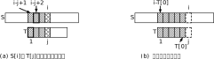
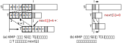
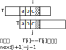
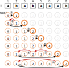
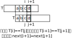
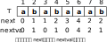

## 目标要求

  - 掌握串及串的一些相关概念；
  - 了解串的存储方法；
  - 掌握串的基本运算及实现算法。

# 4.1 串类型的定义

## 串的相关概念

串（字符串）
  ~ 由零个或多个字符组成的有限序列

长度
  ~ 串中字符的数目
  ~ 零个字符的串称为**空串**（空串的长度为零）

子串和主串
  ~ 串中任意个连续的字符组成的子序列称为该串的**子串**
  ~ 包含子串的串称为**主串**

- - -

位置
  ~ 字符在串中的**位置**：字符在序列中的序号
  ~ **子串在主串中的位置**：子串的第一个字符在主串中的位置

串相等
  ~ 两个串的值相等
  ~ 各个对应位置的字符都相等

- - -

串常量
  ~ 字面常量，通常用引号括起来

空格串
  ~ 一个或多个空格组成的串，不同于空串

串的特点
  ~ 逻辑结构是线性的
  ~ 通常以串的整体作为操作对象

## 串的 ADT 定义

  - 数据对象：属于同一字符集
  - 数据关系：线性关系
  - 基本操作：
    - StrAssign (&T,chars) 生成串
    - StrCopy (&T,S) 复制串
    - StrEmpty (S) 判空
    - StrLength (S) 求长度
    - ClearString (&S) 清空串

- - -

  - 基本操作：
    - Concat (&T,S1,S2) 连接串
    - StrCompare (S,T) 比较串（+-0表示><=）
    - SubString (&Sub,S,pos,len) 求子串
    - Index (S,T,pos) 求子串位置（串的模式匹配）
    - Replace (&S,T,V) 字符串替换
    - StrInsert (&S,pos,T) 插入串
    - StrDelete (&S,pos,len) 删除串
    - DestroyString (&S) 销毁串

# 4.2 串的表示和实现

## 串的存储结构

  - （1）**定长顺序存储**
    - 连续的存储单元存储串值
    - 最大长度固定，超过最大长度则“截断”
  - （2）**堆分配存储**
    - 动态分配的连续存储单元存储串值
    - 长度几乎不受限制
  - （3）**块链存储**
    - 采用链表方式存储串值
    - 每个结点存放一个或多个字符
    - 存储密度较低，操作不够方便

- - -

串的定长顺序存储结构：
````c++
/// 定长顺序串
const int MAXSTRLEN = 254;  // 串的最大长度
typedef unsigned char SString[MAXSTRLEN+2]; // [0] 表示串长度
````

>  [0] 表示串长度，串值从 [1] 开始。

# 4.3 串的模式匹配算法

## 子串定位函数 Index(S,T,pos)

  - 功能：求子串在主串中的位置
  - 思路：模式串与主串逐个字符对比，匹配不成功时，再从主串中的下一个字符开始重新和模式串比较。



- - -

````c++
/// 定位子串
int Index(SString S, SString T, int pos)
{
    i = pos, j = 1;
    while (i<=S[0] && j<=T[0]) {
        if (S[i] == T[j]) { ++i; ++j; }
        else {
            i = i-j+2;  // 主串回溯
            j = 1;
        }
    }
    return j>T[0] ? i-T[0] : 0;
}
````

## KMP 算法

  - Index(S,T,pos) 算法在字符 S[i] 和 T[j] 失配时：
    - 主串回溯 i = i-j+2
    - 模式串从头开始 j = 1
  - KMP 算法的不同：
    - 字符 S[i] 和 T[j] 失配时主串不回溯
    - 模式串不必从头开始，而是回溯到一个恰当的位置 next[j] = k+1
    - 使得 S[i] 前面 k 个字符恰好与 T 开头 k 个字符匹配

- - -

  - KMP 算法 S[i] 和 T[j] 失配时
    - 模式串向右滑动
    - 回溯到“一个恰当的位置” next[j] = k+1
    - 此时 T[1..k] 与 T[j-k+1..j-1] 相等



- - -

  - KMP 算法

````c++
/// KMP算法
int Index_KMP(SString S, SString T, int pos)
{
    get_next(T, next);  // 求失配函数值 next

    i = pos, j = 1;
    while (i<=S[0] && j<=T[0]) {
        if (j==0 || S[i] == T[j]) { ++i; ++j; }
        else j = next[j];  // 模式串滑动
    }
    return j>T[0] ? i-T[0] : 0;
}
````

- - -

  - 求失配函数 next 的算法
    - 定义 next[1] = 0 （第一个字符失配）
    - 若子串 T[..i] 与 T[1..j] 相等，可以得知 next[i+1] = j+1



- - -

  - 求失配函数 next 的算法

````c++
/// 根据模式串 T 计算失配函数值 next[]
void get_next(SString T,int next[])
{
    i = 1, j = 0;
    next[1] = 0;
    while (i < T[0]) {
        if (j==0 || T[i]==T[j]) {
            ++i; ++j;
            next[i] = j;
        } else {
            j = next[j];
        }
    }
}
````

- - -

例：模式串 `T='ababaaab'` 对应的失配函数值 next 为`________`。




- - -

  - 求失配函数的修正值 nextval
    - 在 T[i+1]==T[j+1] 的情况下，若 T[i+1] 失配，回溯到 next[i+1] = j+1，必然导致再次失配。
    - 此时令 next[i+1] = next[j+1] 可以避免失配回溯后二次失配的情况。



- - -

  - 求失配函数的修正值 nextval

````c++
/// 根据模式串 T 计算失配函数值 nextval[]
void get_nextval(SString T,int nextval[])
{
    int i = 1, j = 0;
    nextval[1] = 0;
    while (i < T[0]) {
        if (j==0 || T[i]==T[j]) {
            ++i; ++j;
            nextval[i] = T[i]!=T[j] ? j : nextval[j];
        } else {
            j = nextval[j];
        }
    }
}
````

- - -

例：模式串 `T='ababaaab'` 对应的失配函数修正值 nextval 为`________`。





## 习题

  - 4.1 长度为 n 的串的子串最多有多少个?
  - 4.2 （1）`SubString("data structure",3,5)=______`，（2）`Index("a bc","bc")=______`， （3）`Replace("aaa","aa","a")=______`
  - 4.3 模式串 `P=‘abaabcac’` 的 next 函数值序列为`________`，修正值 nextval 为 `________`。

---
###### SETTINGS ######
#revealjs-url: https://cdn.bootcss.com/reveal.js/3.4.1
math: |
  <script type="text/x-mathjax-config">
  MathJax.Hub.Config({showMathMenu:false,
  TeX:{equationNumbers:{autoNumber:'AMS'}}});
  </script>
  <script type="text/javascript" async 
  src="MathJax/MathJax.js?config=TeX-AMS_HTML">
  </script>
---
